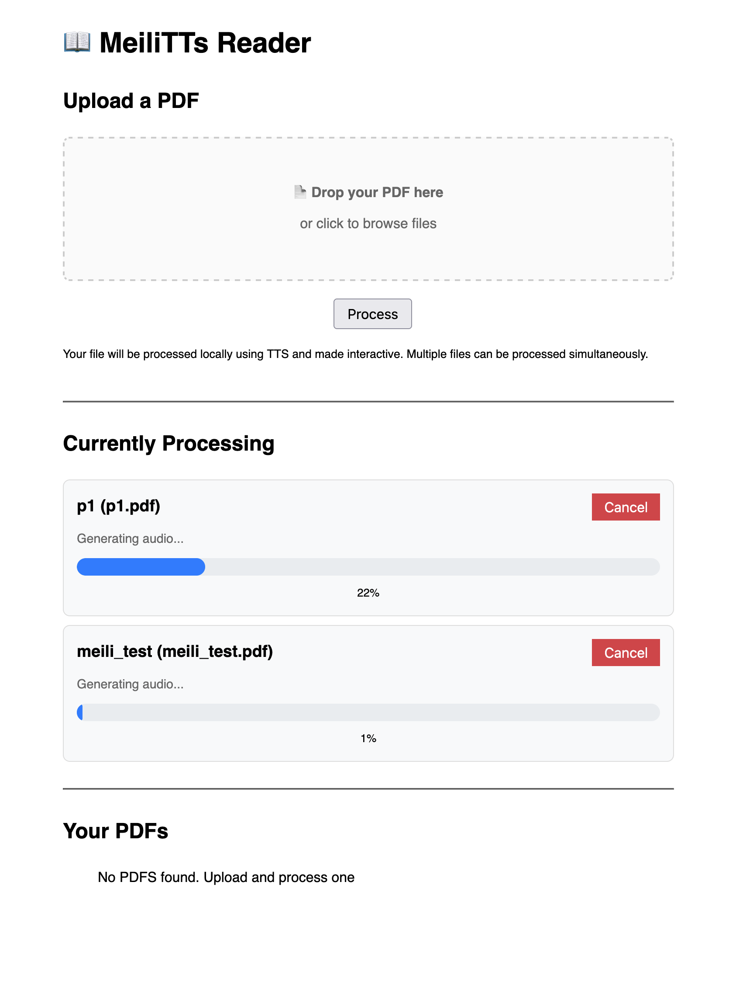

Download here: https://drive.google.com/file/d/16okbqCzPgAn27-o-dqy9rdyh61RNfHDt/view?usp=sharing

Or make your own :).

_Needs system Python > 3.8, presumably M chip Mac (only tested on this)_

## MeiLiTTs App.

A lightweight (25mb) open source TTS reader!

Upload your PDFs, watch them process **locally**, then follow along with them!

_only works on mac - potentially only on m3 - haven't checked anything else :p_

Main view:

Multi-processing:

Reader View:

### Instructions

1. Download the zip. Unzip it.
2. Put folder on desktop. Open the folder. Double click launch.command.
3. This will open a terminal window. Don't be alarmed.
4. If you've never ran this before it may download a new Python. This will take time. Errors may happen.
5. The first time uing this app or after moving the folder, the environment will be rebuilt. This may take a couple of minutes.
6. When ready, an icon thing will open in the top right of your screen (near the date/time), and the website should open
7. Keep the terminal window open while running.
8. Use the icon to quit the app when you're done
9. Processed files will be saved locally. You can see them in the processed/ folder. Feel free to open this up and copy files out, but try not to change anything as it may break.

### Dev Information

1. bin/ has espeak-ng stuff in it. This should just work.

2. Run `./make_release.sh` to make a release. It will clean up the python/ folder, then zip up the meili_tts_simple folder (you may need to run chmod +x first). This will fail if you don't have python3.12. Feel free to rewrite this using a LLM. This is what I did.

3. Uses [Kokoro](https://github.com/hexgrad/kokoro?tab=readme-ov-file), this is why we need espeak-ng package

### TODO:

1. Get rid of old version
2. Get rid of external requirements.txt? and venv? Only really need this inside? or maybe keep it for dev
