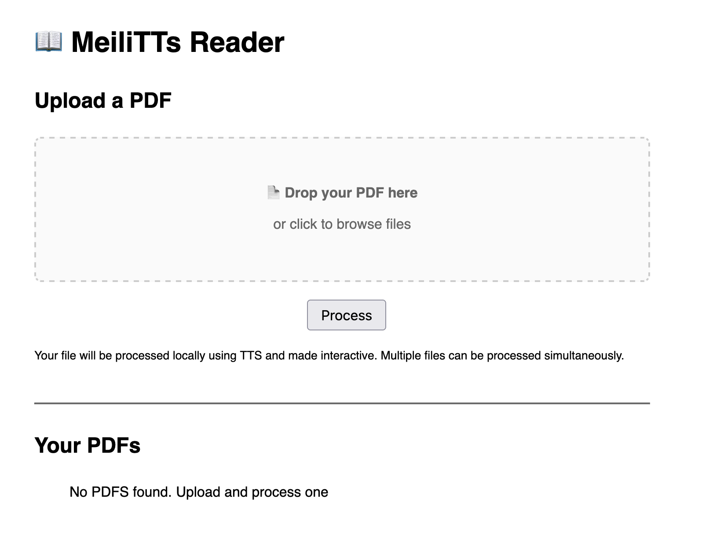
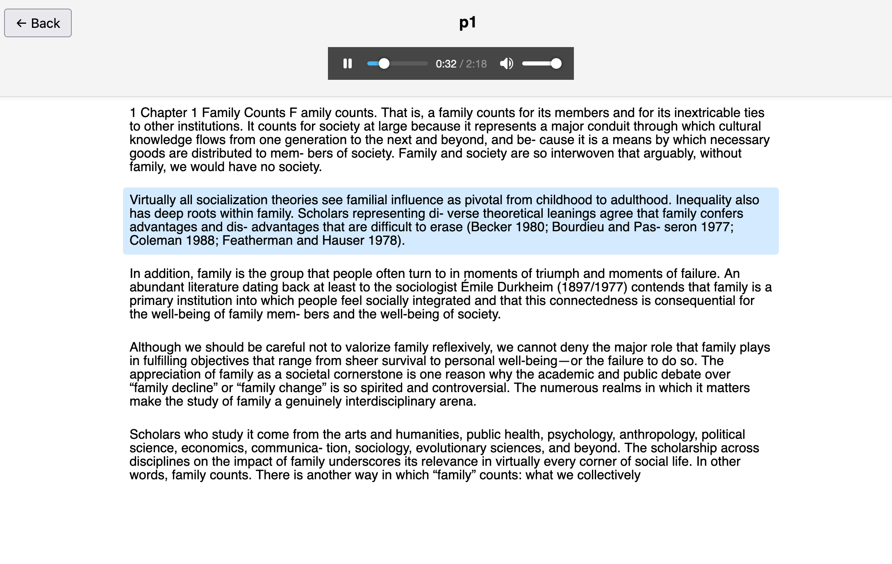

## MeiLiTTs App.

A lightweight (250mb :laughing:) open source TTS reader!

Upload your PDFs, watch them process locally, then follow along with them!

_only works on mac - potentially only on m3 - haven't checked anything else :p_

Main view:

Reader View:

Link to download: https://drive.google.com/file/d/1_1m24ZZNijrc7OirrHCSYxWHbqeLXP1g/view

### Information!

1. bin/ has espeak-ng stuff in it. This should just work.

2. python/ folder created with cp -R `pyenv which python3` python/. This is too big to be uploaded to github so it will be left as an excercise to the reader

3. Run `./make_release.sh` to make a release. It will clean up the python/ folder, then zip up the meili_tts_simple folder (you may need to run chmod +x first)

4. Run `./rebuild_python.sh` to rebuild the python lib in MeiLiTTs w/ your python3 from your computer. Note that you should have pyenv for this to work - you may have to rewrite this script- I put ~5s of asking ChatGPT into it.

5. Uses [Kokoro](https://github.com/hexgrad/kokoro?tab=readme-ov-file), this is why need espeak-ng package

### TODO:

1. Get rid of old version
2. Get rid of external requirements.txt? and venv? Only really need this inside? or maybe keep it for dev idk.
3. Streamline the python/ creation & some stuff in that vein.
